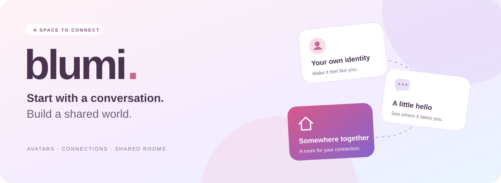

<p align="center">
  
</p>

<p align="center">
  
  
  
  
  
</p>

<h1 align="center">Meet through personality. Connect through conversation.</h1>

Blumi is an avatar-first social mobile app combining discovery, mutual matching, messaging, and shared virtual rooms. People can express themselves through a character and a personal space, then connect at their own pace.

This repository contains the React Native application, backend API, real-time services, and shared TypeScript packages. **Status: active development and closed-test preparation.**

[Product experience](#product-experience) · [Engineering highlights](#engineering-highlights) · [Explore the code](#explore-the-code) · [Run locally](#run-locally)

<br />

<table>
  <tr>
    <td align="center" width="33%">
      <br />
      
      <br /><strong>A little personality.</strong><br />
      <sub>Your style. Your character.</sub><br /><br />
    </td>
    <td align="center" width="34%">
      
      <br /><br /><strong>Good connections<br />start with a hello.</strong><br /><br />
      <sub>Express yourself.<br />Meet someone.<br />Make room for a connection.</sub>
    </td>
    <td align="center" width="33%">
      <br />
      
      <br /><strong>A new possibility.</strong><br />
      <sub>A conversation worth starting.</sub><br /><br />
    </td>
  </tr>
</table>

<p align="center"><sub>Characters from Blumi's onboarding artwork.</sub></p>

<a id="product-experience"></a>

## ✦ Product experience

**Create an avatar → Discover people → Match → Start a conversation → Meet in a shared room**

| 🌷 Make it yours | 💬 Find a connection | 🏡 Share a space |
| :--- | :--- | :--- |
| Build an avatar with clothing and accessories. Decorate a room that expresses your style. | Discover profiles and interests. Start a text conversation after a mutual match. | Send a room invitation from chat. Meet in a shared copy of the host's decor, with optional live voice. |

**Your pace, your boundaries.** Notification preferences, blocking, reporting, account export, and deletion give users control over their experience.

The product centers on avatars, text, and optional live voice. Photos, video calls, and voice messages are outside the current product scope.

<a id="engineering-highlights"></a>

## ◈ Engineering highlights

The implementation focuses on keeping user-visible behavior consistent when requests overlap, connections drop, or background jobs retry.

| Area | Implementation approach |
| --- | --- |
| Account isolation | Session-generation guards prevent delayed responses from a previous account from overwriting the current session. |
| Durable messaging | PostgreSQL transactions and an outbox coordinate message persistence and delivery jobs, with retries and message-ID deduplication. |
| Stable discovery | Server-side candidate snapshots support pagination while decisions and eligibility change; current access checks still apply to each page. |
| Shared room state | Accepted invitations preserve the host's decor so both participants receive the same room data. |
| Service lifecycle | Readiness checks, bounded requests, and graceful shutdown coordinate active work with database closure. |
| Privacy | Generic chat push bodies, telemetry filtering, and streamed account exports reduce unnecessary exposure and memory usage. |

## ⚙ Technology

| Layer | Stack |
| --- | --- |
| Mobile | Expo SDK 57, React Native, TypeScript |
| Backend | Node.js, Fastify, WebSocket |
| Persistence | PostgreSQL, versioned SQL migrations |
| Shared code | TypeScript contracts, domain rules, real-time client |
| Workspace | npm workspaces with a single root lockfile |

<a id="explore-the-code"></a>

## ↗ Explore the code

| Directory | Responsibility |
| --- | --- |
| [apps/mobile](apps/mobile) | Screens, onboarding, avatars, room rendering, and mobile state |
| [apps/server](apps/server) | Authentication, API routes, real-time services, workers, and data access |
| [packages/contracts](packages/contracts) | Shared request, response, and event contracts |
| [packages/domain](packages/domain) | Shared business rules and catalogs |
| [packages/realtime-client](packages/realtime-client) | Real-time client package |
| [scripts/security](scripts/security) | Dependency checks, source hygiene, and isolated PostgreSQL verification |

For a closer look at behavior under failure and concurrency:

- [Account deletion and notification dispatch races](apps/server/src/db/postgresDiscoveryWatchAtomicity.postgres.test.ts)
- [Durable chat delivery and rollback](apps/server/src/db/postgresChatRepository.postgres.test.ts)
- [Discovery pagination across changing eligibility](apps/server/src/matches/postgresDiscoverySnapshots.test.ts)
- [Streaming a 100,000-message account export](apps/server/src/account/accountDataExport.postgres.test.ts)

## Run locally

<details>
<summary><strong>Developer setup — requirements, installation, and local commands</strong></summary>

### Requirements

- Node.js 22.22.2 (`nvm use`) and npm 10+
- PostgreSQL tools (`initdb`, `pg_ctl`) on `PATH` for full verification
- Xcode and CocoaPods for native iOS development

### Install

```bash
npm ci
cp .env.example .env.local
```

Use the root workspace and lockfile for installation. Do not create separate lockfiles inside workspaces. Local environment files are ignored by Git; use the example files to configure each environment.

The default local server uses in-memory storage and development providers. Configure persistent storage and external integrations separately. Keep real credentials in ignored environment files or a deployment secret manager.

### Start the application

Start the API and real-time server:

```bash
npm run dev:server
```

In a second terminal, start Expo:

```bash
npm start
```

This starts Metro from `apps/mobile` on LAN port `8081` for Expo Go. The phone must be able to reach the development machine and its configured API address.

For a clean Metro cache:

```bash
npm --workspace @blumi/mobile run start:clear
```

For a development client with native integrations:

```bash
npm --workspace @blumi/mobile run start:dev-client
```

To build the native iOS app locally:

```bash
cd apps/mobile
SENTRY_DISABLE_AUTO_UPLOAD=true npm run ios
```

</details>

## ✓ Verification

```bash
npm run verify
```

The pipeline runs source-hygiene checks, dependency-policy tests, package builds, type checks, lint, workspace tests, isolated PostgreSQL integration tests, the production dependency audit, and Expo Doctor.

The PostgreSQL gate creates a temporary cluster accessible through a local Unix socket. It does not use an existing `DATABASE_URL`. Migrations are tested from an empty database and on a repeated run; missing tools or skipped database tests fail the gate. The cluster is stopped and its generated data removed afterward, while diagnostic logs are retained. Set `BLUMI_PG_KEEP_TEST_DATA=1` only when retaining a test database for investigation.

Installation applies a version-specific React Navigation compatibility patch for the updated `query-string` dependency. Source checks and deep-link regression tests cover this patch.

Automated source checks complement device testing. Real-device audio, push delivery, purchase-provider flows, and file sharing require separate integration validation. Production packaging checks legal configuration before native preparation; preview configuration does not establish production readiness.
