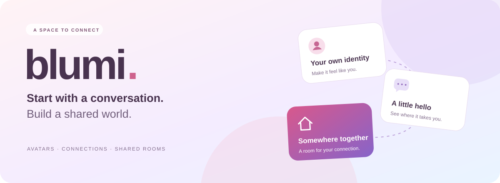

<p align="center">
  
</p>

<p align="center">
  <strong>An avatar-first social app. A conversation that becomes a shared space.</strong>
</p>

<p align="center">
  
  
  
  
  
</p>

<p align="center">
  <a href="#the-experience">The experience</a> ·
  <a href="#inside-blumi">Inside Blumi</a> ·
  <a href="#getting-started">Getting started</a> ·
  <a href="#verification">Verification</a> ·
  <a href="#project-status">Project status</a>
</p>

---

## The experience

Blumi is an anonymous-first mobile social app built around personality, text conversations, and sweet 2.5D chibi characters. An avatar and a personal room give people a way to express themselves before deciding how they want to connect.

**Discover → Mutual match → Text chat → Optional room invitation → Shared room**

<table>
  <tr>
    <td align="center" width="33%">
      <br />
      
      <br /><strong>Make it yours.</strong><br />
      <sub>Your character. Your style. Your room.</sub><br /><br />
    </td>
    <td align="center" width="34%">
      
      <br /><br /><strong>Start with a hello.</strong><br />
      <sub>Find a mutual connection.<br />Let the conversation grow.</sub><br /><br />
    </td>
    <td align="center" width="33%">
      <br />
      
      <br /><strong>Make room for someone.</strong><br />
      <sub>A shared space, at your own pace.</sub><br /><br />
    </td>
  </tr>
</table>

- **Express yourself:** customize a character with clothing and accessories, and decorate a personal room.
- **Connect through conversation:** discover people and start messaging after a mutual match.
- **Share a space:** invite someone from chat into a room based on the host's decor. Shared-room text is durable.
- **Keep control:** manage notification preferences, block or report accounts, and request account export or deletion.

The first release is text-only. Voice, photos, GIFs, video, camera flows, calls, voice messages, and app sound are outside its scope.

## Inside Blumi

This monorepo contains the mobile app, backend, real-time client, and shared business rules.

| Layer | Technology | Location |
| --- | --- | --- |
| Mobile app | Expo SDK 57, React Native 0.86, React 19, Reanimated 4 | [apps/mobile](apps/mobile) |
| API and real-time services | Node.js, Fastify, WebSocket | [apps/server](apps/server) |
| Persistence | PostgreSQL and versioned SQL migrations | [Database migrations](apps/server/db/migrations) |
| Boundary contracts | Shared TypeScript request, response, and event types | [packages/contracts](packages/contracts) |
| Domain rules | Business rules, catalogs, and stable product IDs | [packages/domain](packages/domain) |
| Real-time client | Shared connection and event handling | [packages/realtime-client](packages/realtime-client) |

### Built for continuity

The backend owns inventory, purchases, balances, avatar loadouts, room persistence, and access decisions. Mobile previews and real-time presence do not establish ownership.

Durable messaging uses PostgreSQL transactions, an outbox, retries, and message-ID deduplication. Session-generation guards protect account changes from delayed responses. Shared-room invitations preserve the host's decor for both participants.

Characters use one layered-PNG renderer across room surfaces. Movement and animation frames run on the UI thread; canonical cosmetic IDs stay consistent across Shop, Inventory, Wardrobe, rooms, and remote participants.

<details>
<summary><strong>Explore the failure and concurrency checks</strong></summary>

- [Account deletion and notification dispatch races](apps/server/src/db/postgresDiscoveryWatchAtomicity.postgres.test.ts)
- [Durable chat delivery and transaction rollback](apps/server/src/db/postgresChatRepository.postgres.test.ts)
- [Discovery pagination as eligibility changes](apps/server/src/matches/postgresDiscoverySnapshots.test.ts)
- [Streaming large account exports](apps/server/src/account/accountDataExport.postgres.test.ts)

</details>

## Getting started

### Requirements

- **Node.js 22.23.3** — pinned in [.nvmrc](.nvmrc).
- **npm 10+** — install dependencies from the repository root using the shared lockfile.
- **Xcode and CocoaPods** — required for local native iOS builds.
- **PostgreSQL tools** — `initdb` and `pg_ctl` on `PATH` for the full verification gate; the initial in-memory server does not need PostgreSQL.

### 1. Install and configure

From the repository root:

```bash
nvm use
npm ci
npm run build:packages
```

For a new checkout, create the ignored local environment files:

```bash
cp .env.example .env.local
cp apps/mobile/.env.example apps/mobile/.env.local
```

The server template uses in-memory storage and development providers. The mobile template points to the local HTTP API on port `4000` and WebSocket service on port `4100`. See the [server setup](apps/server/README.md) for persistent storage and provider configuration.

### 2. Start the server

```bash
npm run dev:server
```

### 3. Start the mobile app

In a second terminal:

```bash
npm run dev:mobile
```

Metro starts on LAN port `8081` for the Blumi native development client. A development build must be installed on the phone or Simulator. For the first local iOS build:

```bash
cd apps/mobile
SENTRY_DISABLE_AUTO_UPLOAD=true npm run ios
```

For a physical phone, set the local server's `HOST` to `0.0.0.0` and configure the mobile API and WebSocket addresses with the development machine's reachable LAN address. `127.0.0.1` on the phone refers to the phone itself.

<details>
<summary><strong>Useful development commands</strong></summary>

Run these from the repository root:

| Command | Purpose |
| --- | --- |
| `npm start` | Alias for the mobile development server |
| `npm --workspace @blumi/mobile run start:clear` | Start Metro with a cleared cache |
| `npm --workspace @blumi/mobile run start:dev-client` | Explicitly start the native development client |
| `npm --workspace @blumi/mobile run start:go` | Start Expo Go demos; native integrations need a development build |
| `npm run build:server` | Build shared packages and the backend |
| `npm run doctor` | Check Expo dependency health |

</details>

## Verification

For focused development checks:

```bash
npm run typecheck
npm run lint
npm test
```

For the full repository and release validation gate:

```bash
npm run verify
```

The gate covers source hygiene, operational tooling, package builds, TypeScript, lint, automated tests, isolated PostgreSQL verification, dependency auditing, and Expo Doctor. The exact sequence lives in [package.json](package.json).

PostgreSQL verification creates a disposable local cluster and does not use an existing `DATABASE_URL`. It checks migration application and repeatability. Automated checks support native testing; they do not prove physical-device behavior, a live deployment, or release readiness.

## Project status

**Blumi is in active development and is not publicly released.**

`develop` is the integration branch; `main` is the release branch. Shipping to `main`, deployments, live database migrations, and store submissions require the owner's authorization.

Release status is tracked separately from implementation. Native-device, performance, legal, provider, and App Store evidence must be verified for the build being shipped.

| Reference | What it covers |
| --- | --- |
| [Launch Control](docs/release/LAUNCH_CONTROL.md) | Dated readiness evidence and open release gates |
| [OTA and TestFlight](docs/release/OTA_AND_TESTFLIGHT.md) | Mobile distribution and build constraints |
| [Database release runbook](docs/release/DATABASE_RELEASE_RUNBOOK.md) | Migration, backup, and restore procedures |
| [Engineering rules](docs/quality/ENGINEERING_RULES.md) | Code boundaries, performance, motion, and privacy requirements |
| [Project instructions](AGENTS.md) | Product facts, collaboration rules, and protected operations |

---

<p align="center">
  <strong>Start with a conversation. Build a shared world.</strong>
</p>
